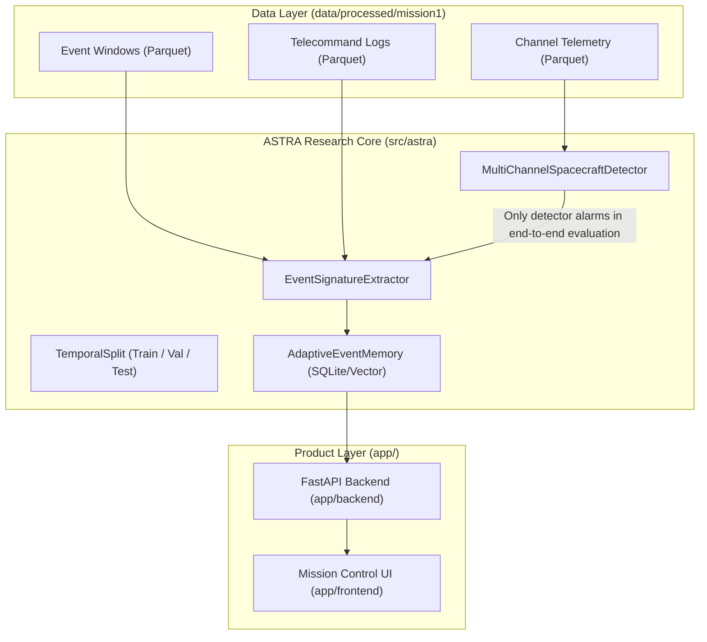

# ASTRA System Architecture

## Overview

ASTRA (Spacecraft Telemetry Health Intelligence Platform) is designed around a clean, reproducible Python research pipeline integrated with a high-performance FastAPI backend and a dark-mode glassmorphic Mission Control dashboard.

---

## Package Structure & Responsibilities (`src/astra/`)

| Package / Directory | Implemented Responsibilities |
| :--- | :--- |
| `astra.data` | Dataset inspection, schema validation, PyArrow Parquet loaders, and temporal split partitions. Raw source data is strictly immutable. |
| `astra.features` | `EventSignatureExtractor`: Generates telemetry statistics and telecommand-context signatures (`tc_count_5m`, `nearest_tc_diff_sec`). |
| `astra.models` | Baseline anomaly detectors (`GlobalStdDetector`, `MultiChannelSpacecraftDetector`, `IsolationForestDetector`). |
| `astra.memory` | `AdaptiveEventMemory`: SQLite-backed vector similarity store using weighted cosine/channel/context similarity and a conditional score-discrepancy guard. |
| `astra.evaluation` | Reproducibility protocol, confusion matrix computation, and metric aggregation (Recall, end-to-end Rare Event detector-alarm reduction; separate retrospective recurrence summaries). |
| `app.backend` | FastAPI REST API endpoints serving current propagated orbital states, public RF observations, and historical research scenarios with operator feedback. |
| `app.frontend` | Glassmorphic Mission Control dashboard using Canvas 2D multi-channel telemetry graphs and 4-stage judge demo controller. |

---

## Data Flow & Memory Pipeline

1. **Telemetry & Anomaly Detection**:
   - `MultiChannelSpacecraftDetector` calculates channel-wise 3-sigma anomaly scores for telemetry windows.
2. **Signature Extraction**:
   - `EventSignatureExtractor` aggregates telemetry statistics across channels 41–46 and correlates recent telecommands from `telecommands.parquet`.
3. **Memory Query & Similarity Matching**:
   - `AdaptiveEventMemory.query()` computes normalized cosine similarity between the current event vector and operator-validated signatures stored in SQLite.
   - A match at similarity >= 0.80 recognizes a stored operational pattern. A conditional guard rejects a match when `cand_score_max > 3.5` and either `mem_score_max < 2.5` or `cand_score_max > 2.0 * mem_score_max`.
   - Unknown detector alarms remain visible. The retrospective recurrence script bypasses detector gating by design and evaluates only labelled Rare Event windows; its recognition rate is not detector performance.

---

## Reproducibility & Integrity Safeguards

- **Chronological Split**: Time-based boundaries (`MISSION1_VALIDATION_BOUNDARY`, `MISSION1_TEST_BOUNDARY`) separate fitting and test windows; they do not undo threshold development on Mission-1.
- **Inference Feature Boundary**: Memory similarity matching operates strictly on un-labelled telemetry features and telecommand proximity. Category/class/subclass are not similarity features, but labels define event windows and simulated review.
- **Reported Settings**: Headline research scripts instantiate detector threshold 3.0 and memory threshold 0.80 directly; generated results report the running values. These exploratory settings were developed while inspecting Mission-1.
