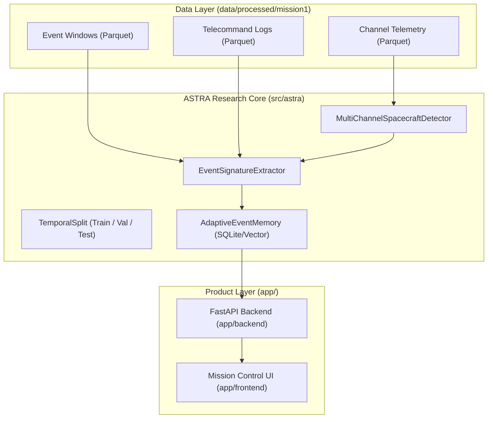

# ASTRA System Architecture

## Overview

ASTRA (Spacecraft Telemetry Health Intelligence Platform) is designed around a clean, reproducible Python research pipeline integrated with a high-performance FastAPI backend and a dark-mode glassmorphic Mission Control dashboard.

---

## Package Structure & Responsibilities (`src/astra/`)

| Package / Directory | Implemented Responsibilities |
| :--- | :--- |
| `astra.data` | Dataset inspection, schema validation, PyArrow Parquet loaders, and temporal split partitions. Raw source data is strictly immutable. |
| `astra.features` | `EventSignatureExtractor`: Generates 10-dimensional statistical telemetry and 9-dimensional telecommand context signatures (`tc_count_5m`, `nearest_tc_diff_sec`). |
| `astra.models` | Baseline anomaly detectors (`GlobalStdDetector`, `MultiChannelSpacecraftDetector`, `IsolationForestDetector`). |
| `astra.memory` | `AdaptiveEventMemory`: SQLite-backed vector similarity store using Cosine Distance math and score-based Anomaly Protection Guard (`cand_score_max > 3.5`). |
| `astra.evaluation` | Reproducibility protocol, confusion matrix computation, and metric aggregation (Recall, Rare Event False Alarm Reduction Rate). |
| `app.backend` | FastAPI REST API endpoints serving real-time telemetry, memory state queries, operator feedback validation, and precomputed demo scenarios. |
| `app.frontend` | Glassmorphic Mission Control dashboard using Canvas 2D multi-channel telemetry graphs and 4-stage judge demo controller. |

---

## Data Flow & Memory Pipeline

1. **Telemetry & Anomaly Detection**:
   - `MultiChannelSpacecraftDetector` calculates channel-wise 3-sigma anomaly scores for telemetry windows.
2. **Signature Extraction**:
   - `EventSignatureExtractor` aggregates telemetry statistics across channels 41–46 and correlates recent telecommands from `telecommands.parquet`.
3. **Memory Query & Similarity Matching**:
   - `AdaptiveEventMemory.query()` computes normalized cosine similarity between the current event vector and operator-validated signatures stored in SQLite.
   - If `best_similarity >= 0.80` AND anomaly score does not trigger the Anomaly Guard (`max_score <= 3.5`), the alarm is classified as `KNOWN_OPERATIONAL_PATTERN` and suppressed.
   - If anomaly score exceeds 3.5 or no memory matches, the alarm remains active (`UNKNOWN_UNUSUAL_EVENT` or `CRITICAL_COMPONENT_ANOMALY`).

---

## Reproducibility & Integrity Safeguards

- **Chronological Split**: Strict time-based boundaries (`MISSION1_VALIDATION_BOUNDARY`, `MISSION1_TEST_BOUNDARY`) prevent future data leakage.
- **Zero Label Leakage**: Memory similarity matching operates strictly on un-labelled telemetry features and telecommand proximity. No ground-truth ESA category/class/subclass fields are used in inference.
- **Config Locking**: All parameters are frozen in `configs/experiment.yaml` and `configs/demo.yaml`.
